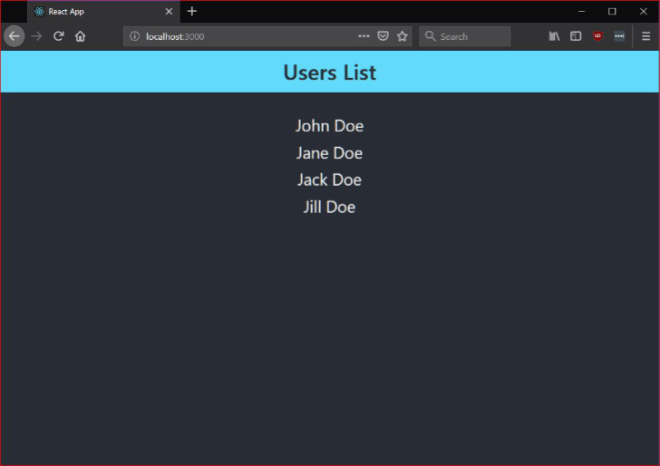

# Basic Fullstack Setup
A basic fullstack setup with client (front-end) and server (back-end) side. establish proxy communication request/fetch data from back-end and render into front-end. 



# Usage

## installation

Install server-side dependencies.
```
yarn install
```

To install client-side dependencies.
```
yarn install-client
```

## Serve

Run on client-side only.

```
yarn client
```

Run on server-side only.
```
yarn server
```

Run server & client side concurrently.
```
yarn start
```

