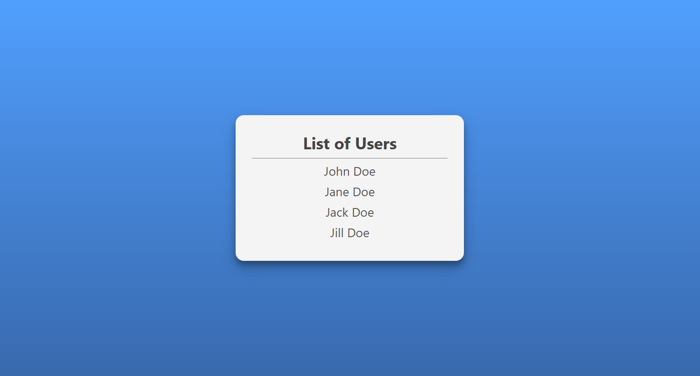

# Basic Fullstack 
A simple and basic fullstack setup to establish communication proxy between client and server.



## Usage
- React (Create-React-App)
- NodeJS/Express
- Sass/Scss

## Installation

Install server-side dependencies.
```sh
yarn install
```

To install client-side dependencies.
```sh
yarn install-client
```

## How does it work?

Backend server generate _"little"_ data storage with list of users. 
```js
server.get('/users', (req, res) => {
	const users = [
		{ id: 1, firstname: 'John', lastname: 'Doe' },
		{ id: 2, firstname: 'Jane', lastname: 'Doe' },
		{ id: 3, firstname: 'Jack', lastname: 'Doe' },
		{ id: 4, firstname: 'Jill', lastname: 'Doe' }
	];

	res.json(users);
});

```

Client side using aysnc/await method will request/fetch for data from backend.

```js
	async componentDidMount() {
		const res = await fetch('/users');
		const users = await res.json();
		this.setState({ users }, () => console.log('users fetched -->', users));
	}

```
then render list of users into browser.
```js
render() {
	const users = this.state.users;
		return (
		    <div>
		      {users.map(user => (
			<div className="item" key={user.id}>
			  {user.firstname} {user.lastname}
			</div>
		      ))}
		    </div>	
		);
	}
```


